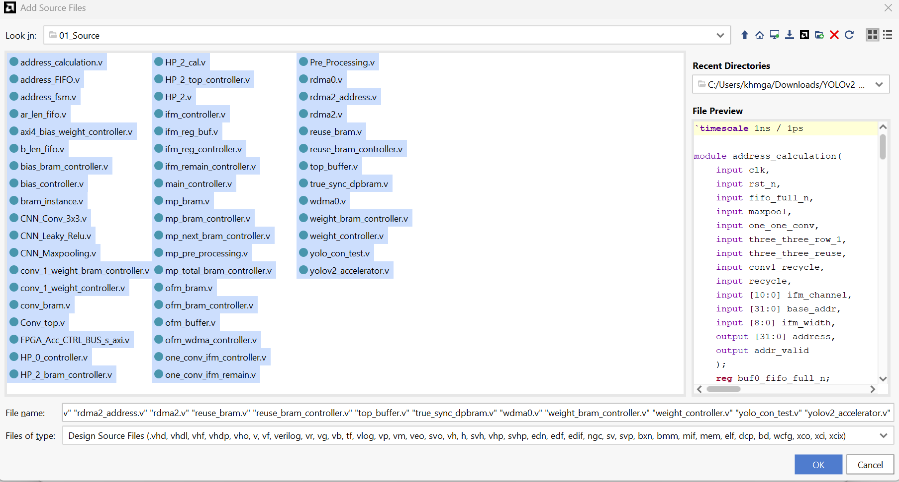
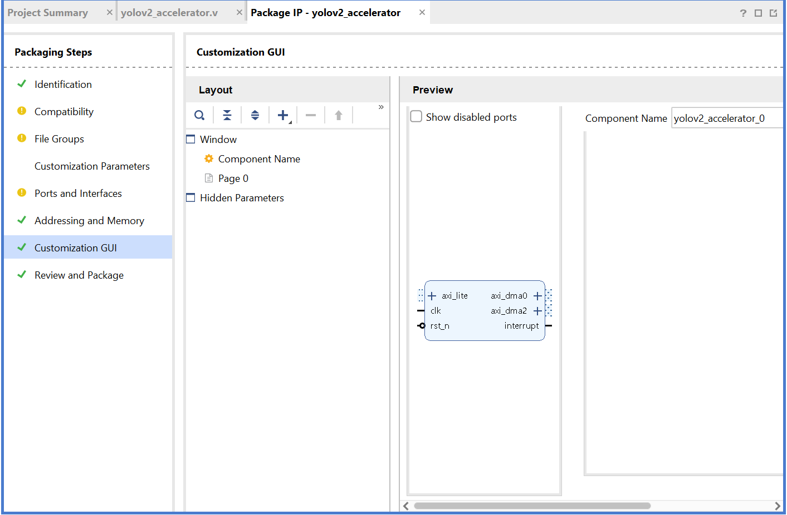

## Creating the YOLOv2 Accelerator IP

This section covers the process of generating the `yolov2_accelerator` IP using Vivado.

1. **Create a Project**: Open Vivado and create a new project.
2. **Add Sources**: Add all Verilog files located in the `01_Source` directory to the project. Then, select the **Zybo Z7-20** board and complete the project creation.
 

 

3. **Verify Hierarchy**: Once the project is created, check the **Design Sources** tab to ensure that the `yolov2_accelerator` top module and its submodules are correctly loaded.
4. **Package IP**: To integrate the design into an actual FPGA system, package the project as an IP.
    * Navigate to: **Tools > Create and Package New IP > Package your current project**
    * > **Important**: Please remember the **IP location** path, as it will be needed in the next steps.
5. **Completion**: Upon completion of the packaging process, the IP will be generated as shown below.
 

 

You may now proceed to the next section.
