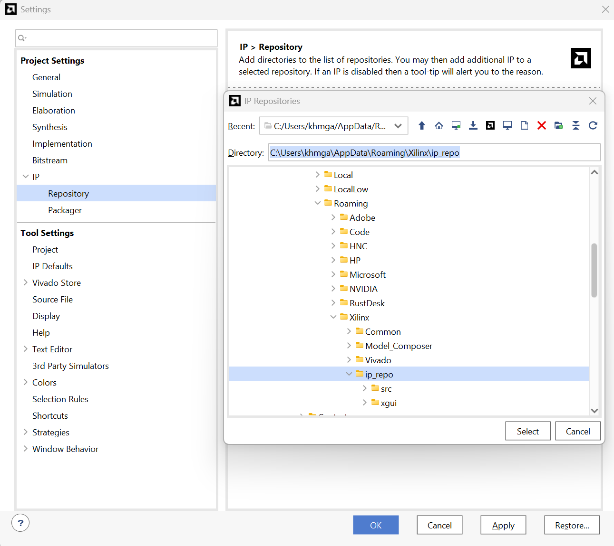
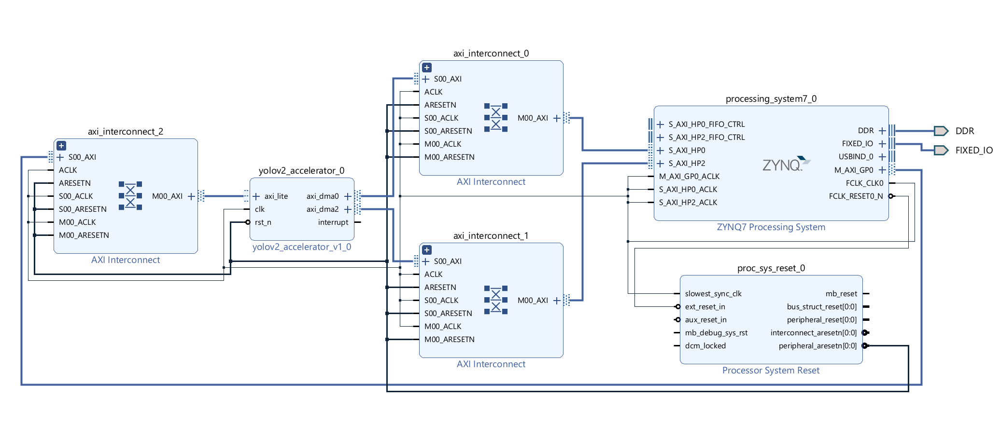
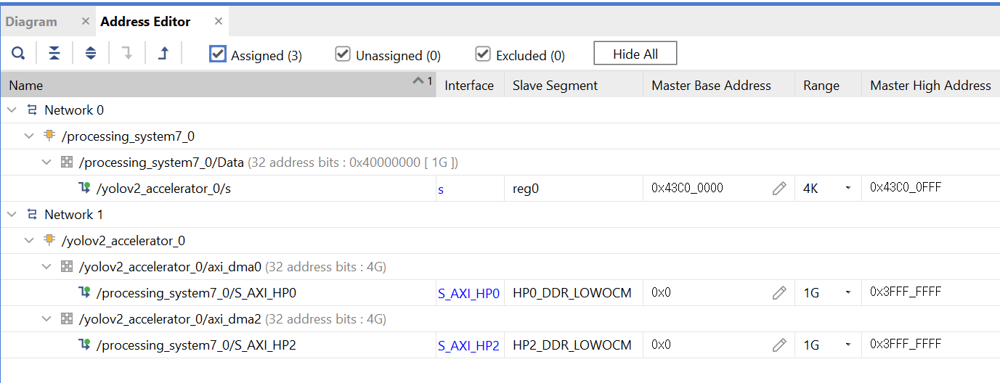
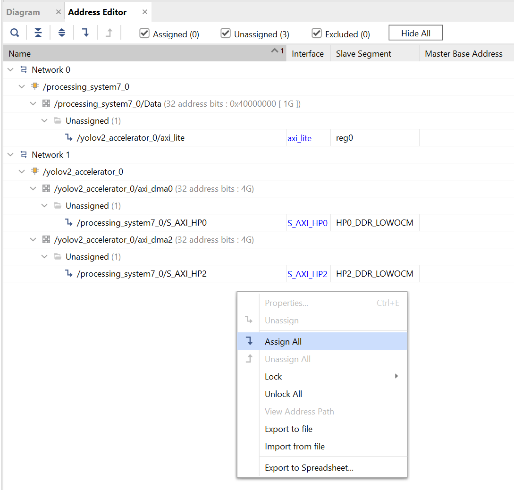
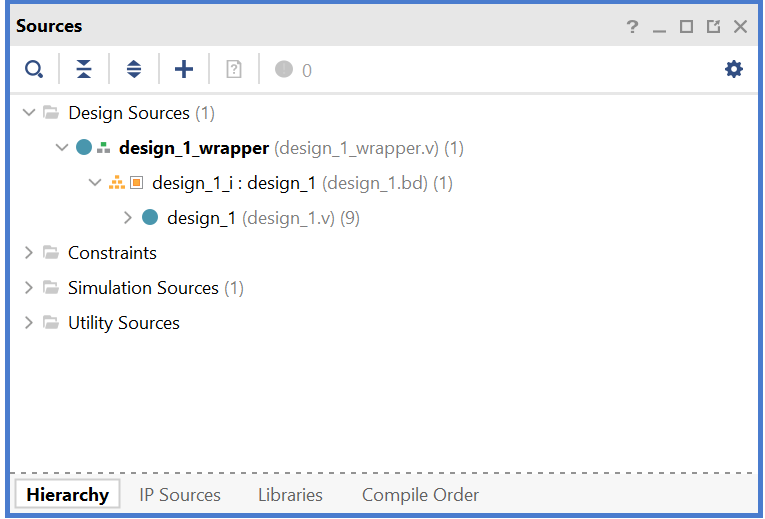

## 01. Block Design & HDL Wrapper Generation

In this section, you will create the HDL wrapper by integrating the accelerator IP into the full FPGA system using **Vivado Block Design**.

1. **Open Settings**: In the newly created project, click **Project Manager > Settings** in the Flow Navigator.
2. **Add IP Repository**: Navigate to **IP > Repository**. Click the **'+'** button and select the directory containing the IP generated in the `01_Source` step.
    * (Example path shown below)
 

  

 

3. **Confirm IP**: Verify that the custom IP appears in the list, then click **Apply** and **OK**.
4. **Create Block Design**: Click **IP INTEGRATOR > Create Block Design**.
5. **Add Zynq PS**: Click the **'+'** button in the Diagram window to add the **ZYNQ7 Processing System** block. Then, click **Run Block Automation** at the top of the window.
6. **Customize Zynq Block**: Double-click the ZYNQ7 Processing System to open the configuration window:
    1. **PS-PL Configuration**: Enable **HP0** and **HP2** Slave interfaces.
    2. **Clock Configuration**: Set **FCLK_CLK0** to **100 MHz**.
7. **Connect Blocks**: Add the remaining blocks as shown in the diagram below and **manually** connect the ports.
 

  

 

8. **Address Editor**: Open the **Address Editor** tab and configure the addresses as shown below.
 

  

> **Tip**: If you are unable to set the addresses manually or if they are unmapped, right-click and select **Assign All**.

  

 

9. **Validate Design**: Click the **Validate Design** (checkbox icon) button to ensure the design is valid.
    * *Note: You can safely ignore Critical Warnings related to Clock Skew.*
10. **Create HDL Wrapper**: In the **Sources** window, right-click your block design file (`.bd`) and select **Create HDL Wrapper**. Choose "Let Vivado manage wrapper and auto-update".

  

<br
---

You may now proceed to the next section: `02_Generate_bitstream`.
