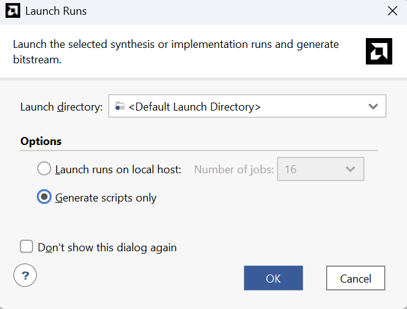
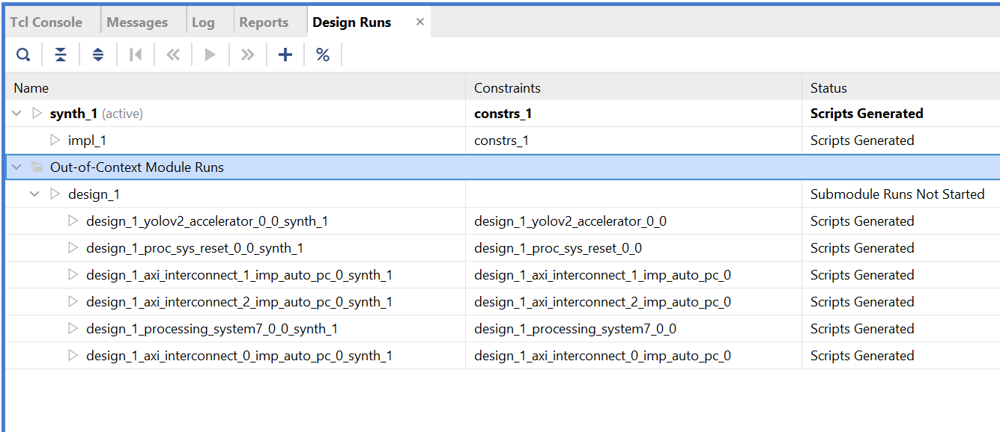
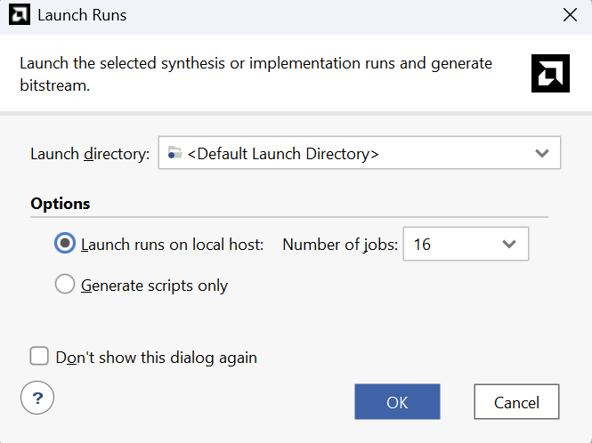
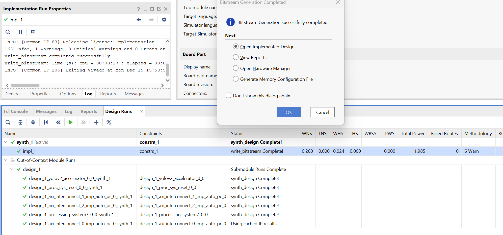
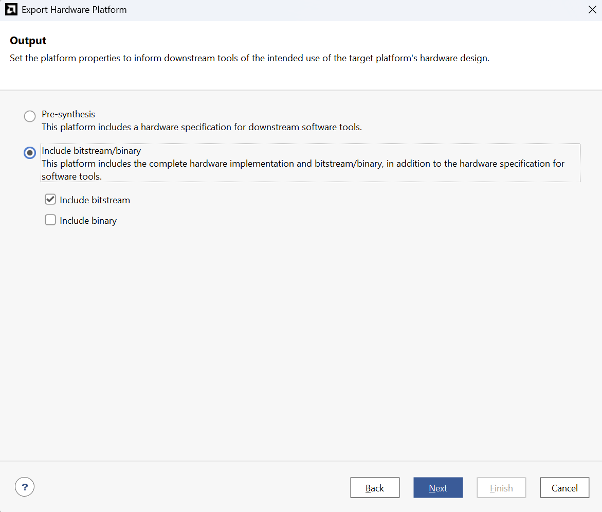

## 02. Synthesis, Implementation & XSA Generation

This section covers the process of synthesizing and implementing the HDL wrapper (the complete FPGA system created in the Block Design) to extract an **XSA file** containing the bitstream. Follow the steps below:

1. **Generate Bitstream**: Click **Generate Bitstream** under the **Program and Debug** section in the Flow Navigator.
    * If a dialog appears stating there are no implementation results, click **Yes** (or **OK**). Vivado will automatically trigger the synthesis and implementation processes.
2. **Generate Scripts**: When the launch runs window appears, select **Generate scripts only** and click **OK**.
 

  

 

3. **Verify Runs**: You will see that scripts for each block have been generated in the **Out-of-Context Module Runs** tab (located at the bottom of the Design Runs window).
 

  

 

4. **Adjust Strategy**: Using the default strategy often results in **timing violations**. Therefore, you must change the synthesis/implementation strategy as shown below:
    * **For Vivado 2023.2**:
     
    
      

    * **For Vivado 2025.1**:
     
    
     

5. **Launch Runs**: Click **Generate Bitstream** again. This time, select **Launch runs on local host** and click **OK** to proceed with synthesis, implementation, and bitstream generation.
 

  

 

6. **Completion**: Once the bitstream is successfully generated, a completion dialog will appear. (You may click OK to view the implementation results).
 

  

 

7. **Export Hardware**: Navigate to **File > Export > Export Hardware**.
 

  

 

8. **Include Bitstream**: Ensure you select **Include bitstream** to package the bitstream within the XSA file.
 

  

 

9. **Finish**: **Remember the export path** of the XSA file. Click **Finish** and verify that the `.xsa` file has been created in the specified directory.
    * All tasks in Vivado are now complete.
    * Please proceed to the next section: `03_Petalinux`.
