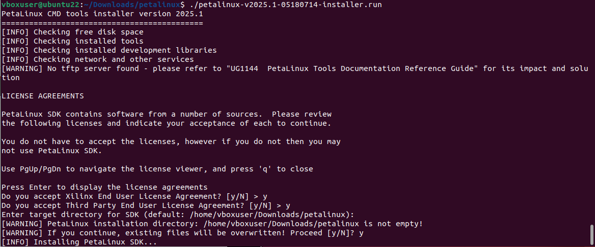
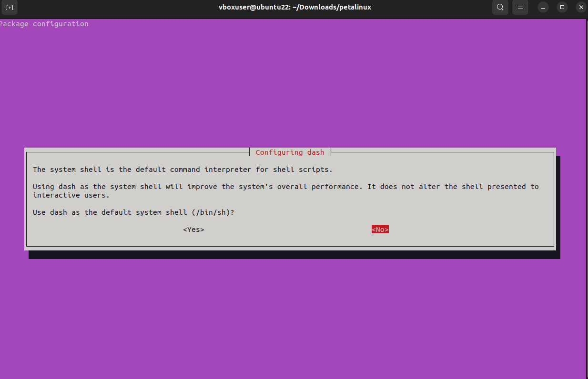
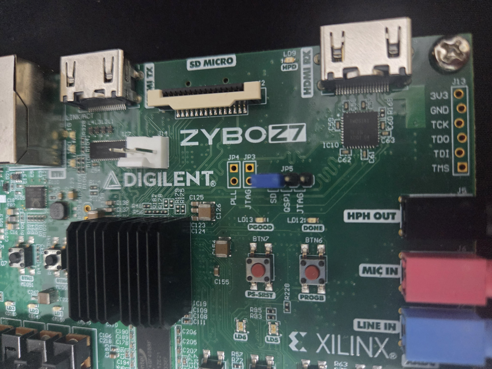

## 03. PetaLinux Build Environment

This section describes the process of building a custom Linux environment using **PetaLinux** (Yocto-based) for the FPGA system. You will generate the OS using the **XSA file** exported in the previous section.

### 0. Install Dependencies
PetaLinux requires specific system dependencies. Please run the following commands based on your Vivado version.

**For Vivado 2023.2:**
> Please refer to the `2023_requirements.txt` file included in this repository and install the listed packages.

**For Vivado 2025.1:**
```bash
sudo apt-get install iproute2 gawk python3 python2 build-essential gcc git make net-tools libncurses5-dev tftpd zlib1g-dev libssl-dev flex bison libselinux1 gnupg wget git-core diffstat chrpath socat xterm autoconf libtool tar unzip texinfo zlib1g-dev gcc-multilib automake zlib1g:i386 screen pax gzip cpio python3-pip python3-pexpect xz-utils debianutils iputils-ping python3-git python3-jinja2 libegl1-mesa libsdl1.2-dev pylint libtinfo5 libncurses5
```

### 1. Installation & Setup

1.  **Download**: Download the PetaLinux installer matching your Vivado version from the [Xilinx Website](https://www.xilinx.com/support/download.html) (Check the *Embedded Software* section).
2.  **Create Workspace**: Create a directory for PetaLinux.
    ```bash
    mkdir -p ~/petalinux
    ```
3.  **Install**: Move the installer to your directory and run it.
    ```bash
    mv petalinux-vXXXX.X-final-installer.run ~/petalinux/
    cd ~/petalinux
    chmod 777 ./petalinux-vXXXX.X-final-installer.run
    ./petalinux-vXXXX.X-final-installer.run
    ```
    <br>
    
    
    <br>

4.  **Configure Shell**: Reconfigure `dash` to use `bash`. Select **NO** when prompted.
    ```bash
    sudo dpkg-reconfigure dash
    ```
    
    <br>

5.  **Initialize**: Source the settings script to set up the environment.
    ```bash
    source settings.sh
    ```

### 2. Create & Configure Project

1.  **Create Project**: Create a new project named `yolo` using the Zynq template.
    ```bash
    petalinux-create -t project -n yolo --template zynq
    cd yolo
    ```

2.  **Update Device Tree**:
    Navigate to the device tree directory and modify the `system-user.dtsi` file using `gedit`.
    
    **[Terminal Command]**
    ```bash
    cd project-spec/meta-user/recipes-bsp/device-tree/files/
    gedit system-user.dtsi
    ```
    
    **[File Content: system-user.dtsi]**
    *(Copy the code below and paste it into the open file)*
    ```dts
    /include/ "system-conf.dtsi"
    / {
        reserved-memory {
            #address-cells = <1>;
            #size-cells = <1>;
            ranges;
    
            reserved: buffer@0x30000000 {
                 no-map;
                 reg = <0x30000000 0x10000000>;
            };
        };
    
        reserved-driver@0 {
            compatible = "xlnx,reserved-memory";
            memory-region = <&reserved>;
        };
        
    };
    ```
    *(After saving the file, return to the project root directory.)*
    ```bash
    cd ../../../../../..
    ```

3.  **Import Hardware**: Import the XSA file generated in the previous section (`02_Synthesis&Implementation`).
    ```bash
    petalinux-config --get-hw-description <path_to_your_xsa_directory>
    ```
    * *Note*: Verify the settings in the configuration menu and select **Exit** to save.

4.  **Rootfs Configuration**: Configure the root filesystem packages.
    ```bash
    petalinux-config -c rootfs
    ```
    * Navigate and enable the following packages:
        * **Filesystem Packages > devel > make**: Enable `make`, `make-dev`
        * **Filesystem Packages > misc > gcc-runtime**: Enable `libstdc++`, `libstdc++-dev`
        * **Filesystem Packages > misc > packagegroup-core-buildessential**: Enable all related options.

### 3. Build & Package

1.  **Build Project**:
    ```bash
    petalinux-build
    ```

2.  **Generate Boot Image**:
    Navigate to the images directory and package the boot files.
    ```bash
    cd images/linux
    petalinux-package --boot --fsbl ./zynq_fsbl.elf --fpga ./system.bit --u-boot
    ```
    * **Output Files**: `boot.scr`, `boot.bin`, `image.ub`

    > **⚠️ Note for Vivado 2025.1 Users**:
    > If `system.bit` is missing after the build:
    > 1. Extract your original `.xsa` file.
    > 2. Rename the extracted `.bit` file to `system.bit`.
    > 3. Copy it to the `images/linux` directory.
    > 4. Run the `petalinux-package` command again.

### 4. Application Setup & Deployment

1.  **Download Application**: Download the YOLOv2 software files using `sw.txt`.
    ```bash
    pip install gdown
    xargs gdown < sw.txt
    unzip yolov2.zip
    ```

2.  **About Weights**: The YOLOv2 weights and bias are quantized to **INT16**.
    * **Memory Layout**: Unlike the reference implementation, weights are stored in the order: **Width > Height > Input Channel > Output Channel**.
    <br>

    
    <br>

3.  **Prepare SD Card**:
    Format your Micro SD card with two partitions:
    * **Partition 1 (500MB, FAT32)**: Copy `boot.scr`, `boot.bin`, `image.ub`
    * **Partition 2 (Remaining, EXT4)**: Copy the unzipped `yolov2` folder.

4.  **Boot**:
    Insert the SD card into the **ZYBO Z7-20** board. Ensure the **JP5** jumper is set to **SD/QSPI** mode as shown below.
    <br>
    
    
    <br>

**Ready to Launch!** All preparations are complete. Proceed to the next section to run the accelerator.
