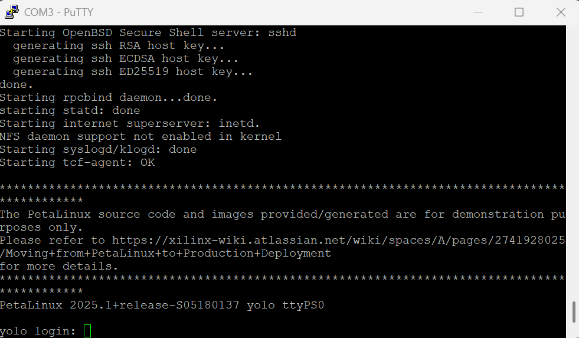
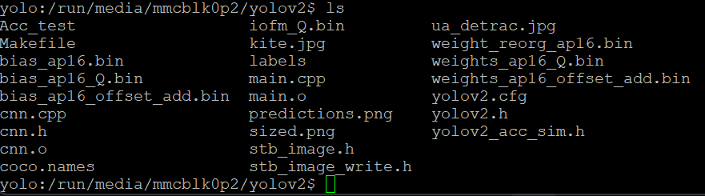
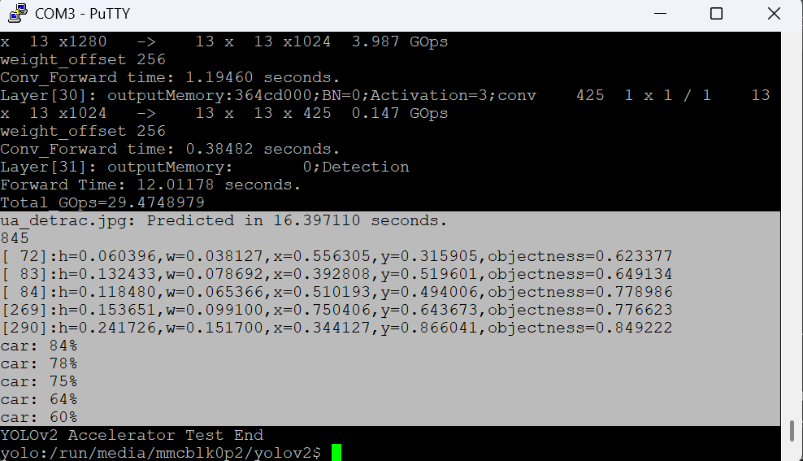
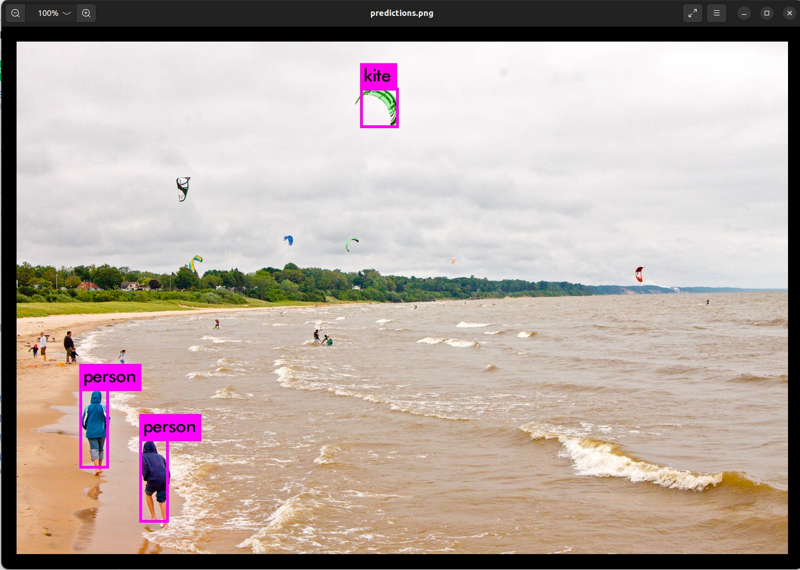

## 04. Running the Accelerator Application

This section demonstrates how to execute the YOLOv2 accelerator application on the **ZYBO Z7-20** board. Follow the steps below to perform inference.

1.  **Hardware Setup**: Connect the ZYBO Z7-20 (with the SD card mounted) to your PC via UART and power it on.
2.  **Open Terminal**: Launch **PuTTY** and set the **baud rate** to **115200**.
3.  **Login**: Wait for the boot process to complete. When the login prompt appears as shown below, log in with the default credentials.
    <br>

    <p align="center">
      
    </p>
    <br>

    * **Login**: `petalinux`
    * **Password**: `root`

4.  **Navigate to Directory**: Move to the mounted EXT4 partition where the YOLOv2 application is stored.
    ```bash
    cd /run/media/mmcblk0p2/yolov2
    ```

5.  **Build Application**: Compile the `Acc_test` application using the `make` command.
    * *Note: You can safely ignore any warnings displayed during the build process.*
    ```bash
    make Acc_test
    ```

6.  **Verify Build**: Check the file list to confirm that the object files (`.o`) and the `Acc_test` executable have been created.
    <br>

    <p align="center">
      
    </p>
    <br>

7.  **Run Inference**: Execute the application with `sudo` permissions to verify operation.
    ```bash
    sudo ./Acc_test
    ```

8.  **Check Results**:
    You will see the object detection process and results displayed in the terminal.
    <br>

    <p align="center">
      
    </p>
    <br>

    Upon completion, the following result images will be generated in the directory:
    <br>

    **Prediction Result:**
    <p align="center">
      
    </p>
    <br>

    **UA-DETRAC Prediction:**
    <p align="center">
      
    </p>
