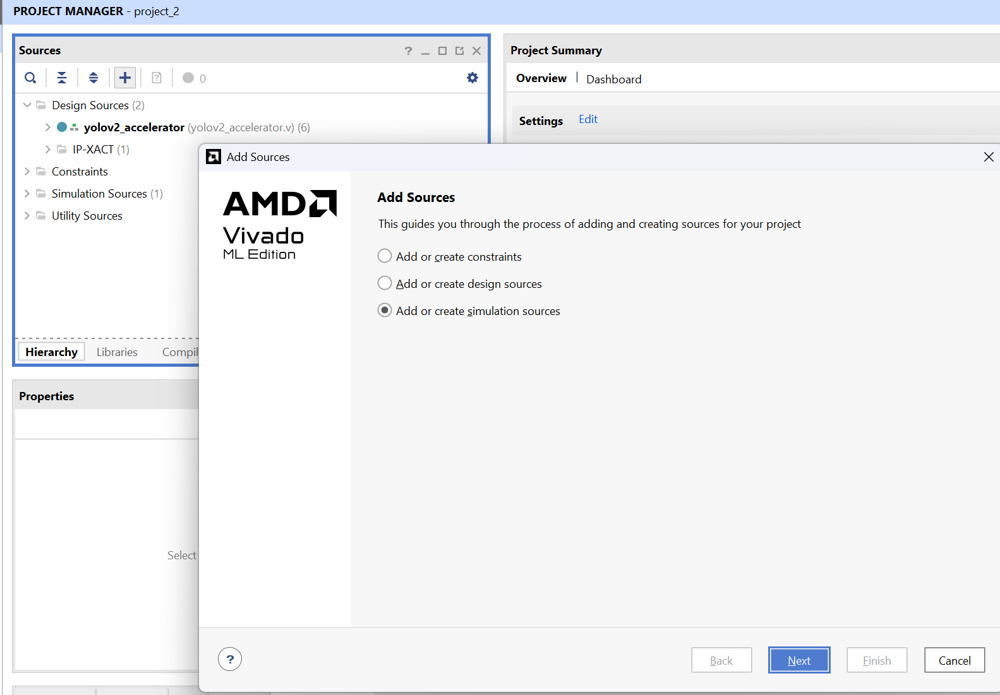
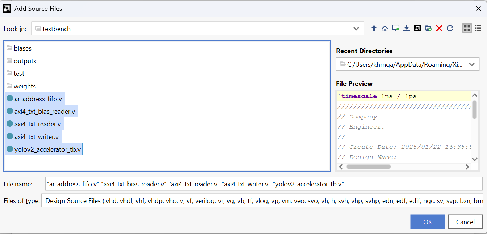
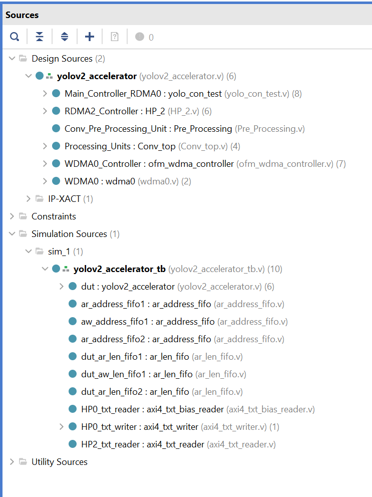
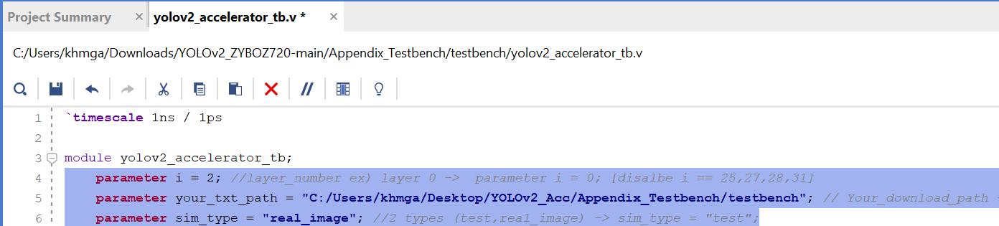

# Appendix: Testbench Simulation

This section provides a testbench environment to verify and simulate the `yolov2_accelerator` (Verilog implementation) using Vivado.

### 1. Download Testbench Files
Due to the large file size, the testbench code is hosted externally. Please download the files from the link below:

* **Download Link**: [Google Drive - Testbench.zip](https://drive.google.com/file/d/15Ss9-Vr7iKvI8DLn__ly7eNvlDacunIr/view?usp=drive_link)

### 2. Simulation Setup Guide

1.  **Prepare Files**: Unzip the downloaded `testbench.zip` and move the contents to the `Appendix_Testbench` directory.
2.  **Open Project**: Open the Vivado project you created in the `01_Source` step.
3.  **Add Simulation Sources**: In the **Sources** window, click the **'+'** button and select **Add or create simulation sources**.
     

    

      
    

     

4.  **Select Files**: Add all Verilog files (`.v`) located inside the unzipped `testbench` folder.
     

    

      
    

     

5.  **Verify Hierarchy**: Confirm that the simulation sources have been successfully added to the project hierarchy.
     

    

      
    

     

6.  **Configure Parameters**: Open the `yolov2_accelerator_tb.v` module and modify **lines 4, 5, and 6** to match your environment. The parameters are defined as follows:

    * `i`: The layer index to simulate.
    * `your_txt_path`: The directory path where the testbench files are located.
    * `sim_type`: Simulation input mode.
        * `"real_image"`: Uses actual pixel data from `kite.jpg`.
        * `"test"`: Uses sequential values starting from 0.

     

    

      
    

     

7.  **Run Simulation**: Click **Run Simulation** in the Flow Navigator to view the detailed waveforms and verify the module's behavior.
