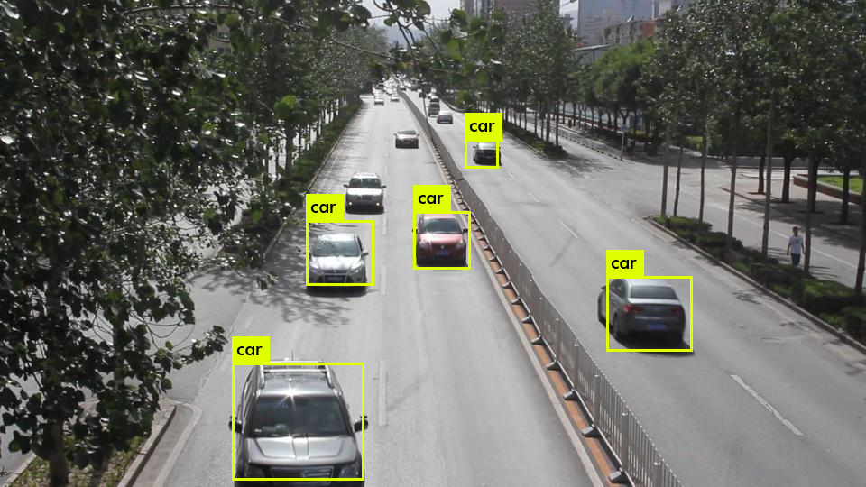

# YOLOv2 Accelerator on ZYBO Z7-20

This project focuses on designing a low-resource hardware accelerator architecture for YOLOv2 on the **ZYBO Z7-20** board using **Verilog HDL**.

The YOLOv2 accelerator architecture (**Programmable Logic**) utilizes **INT16 quantization** to accelerate computation. It is implemented within a **PetaLinux** environment, demonstrating a basic heterogeneous computing system. The software code has been developed by modifying and extending the code of a conventional accelerator [1].

> **Note**: This implementation currently requires approximately **12 seconds** for inference and does not guarantee real-time performance.

 

## Prerequisites & Environment

To replicate this project, the following hardware and software environment is required:

* **Hardware**
    * ZYBO Z7-20 FPGA Development Board
    * Micro SD card(8 GB or more)
* **Software**
    * **Vivado 2023.1 & Ubuntu 22.04.2 LTS**  or  **Vivado 2025.1 & Ubuntu 22.04.5 LTS**
    * PuTTY (for serial communication)

> **Setup Recommendation**:
> You can install Vivado on **Windows**. However, an **Ubuntu** environment is required to use **PetaLinux**. Therefore, if you are a Windows user, it is recommended to set up an Ubuntu environment using **Oracle VirtualBox**.
 

## Getting Started

Once the environment is set up, please proceed with the tasks in the order of the numbered files in this repository.
* 01_Source
* 02_Synthesis&Implementation
* 03_Petalinux
* 04_YOLOv2_With_Petalinux

### Inference Results
Upon successfully completing the steps up to `04_YOLOv2_With_Petalinux`, the system will generate the following predictions files:

**Predictions Result:**

 

## Testbench
The `Appendix_Testbench` section describes the testbench process that can be executed within Vivado. Please refer to it for simulation details.
 

## Paper
As the inference latency is approximately **12 seconds**, significant improvements and optimizations are required for deployment in systems demanding rapid response times. For a deeper understanding of the hardware architecture and implementation details, please refer to the following publication:

* **Paper**: [Design and Implementation of a Low-Resource YOLOv2 Accelerator on Zynq-7000 SoC](https://doi.org/10.3390/s25206359)
 

## References
**[1]** dhm2013724, yolov2_xilinx_fpga. (https://github.com/dhm2013724/yolov2_xilinx_fpga)
